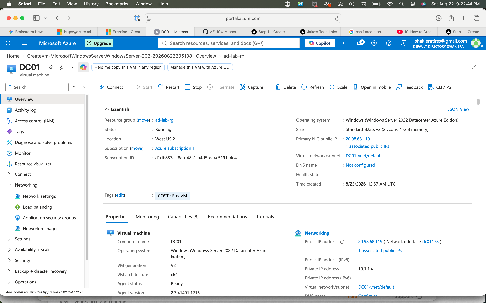
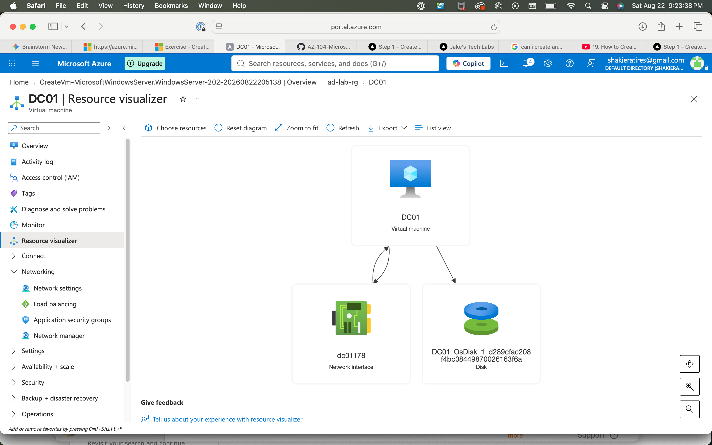
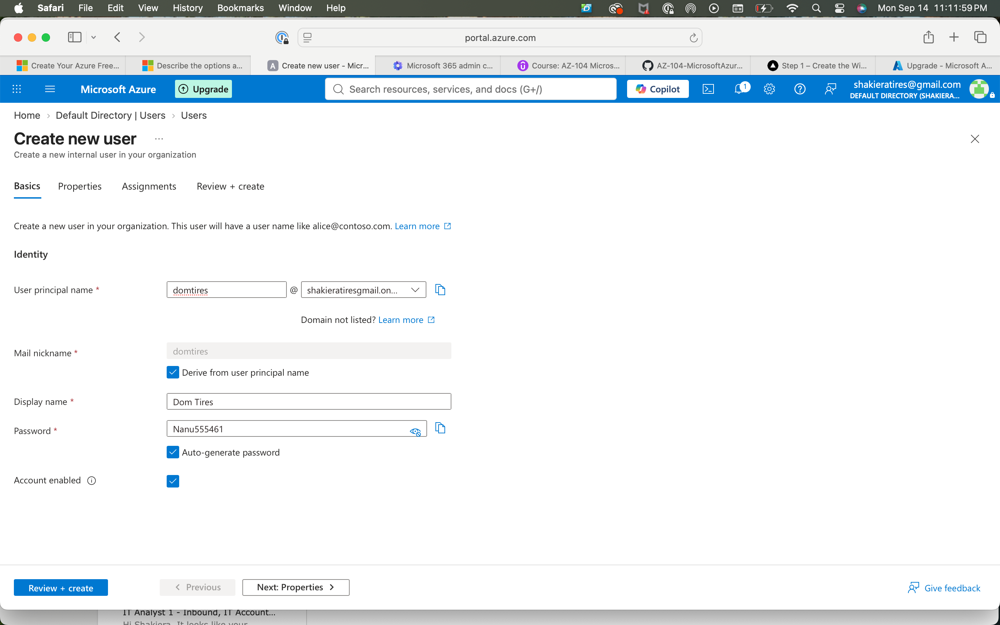
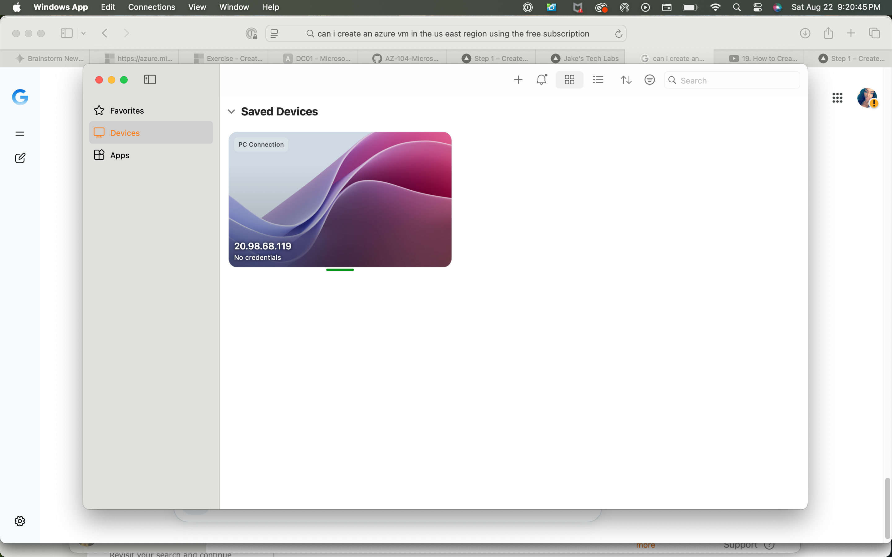

# Azure Virtual Machine Deployment & Remote Access Lab

## 🎯 Objective
Provisioned and configured a Windows Server Virtual Machine (`DC01`) on Microsoft Azure, established secure remote connectivity via Remote Desktop (RDP), and managed identity/access configurations.

## 🛠️ Tech Stack & Concepts
* **Cloud Platform:** Microsoft Azure
* **Compute Resources:** Azure Virtual Machines (Windows Server 2022 Datacenter)
* **Networking:** Virtual Networks (VNets), Public IP Configuration, Network Interfaces (NICs)
* **Remote Administration:** Remote Desktop Protocol (RDP) / Windows App

---

## 📋 Implementation Walkthrough & Screenshots

### 1. Virtual Machine Provisioning & Infrastructure Setup
Deployed a Windows Server 2022 VM (`DC01`) within a designated resource group (`ad-lab-rg`) and verified underlying resource mappings using the Azure Resource Visualizer.
* **VM Overview & Configuration Summary:**

* **Resource Visualizer (NIC & Disk Mapping):**

### 2. Identity Management & User Account Creation
Configured administrative and internal user credentials within the Azure tenant environment to manage access control for the deployment.
* **Creating a New User Profile:**

### 3. Remote Desktop Connection & Administration
Established a remote session to the virtual machine using its public IP address via the Windows App / RDP client to verify active host accessibility and command-line management.
* **RDP Client Connection Configuration:**

* **Successful Remote Session & Command Prompt Access:**

---

## 🚀 Key Takeaways
* Successfully architected and deployed a cloud-based Windows Server compute instance with associated storage and networking components.
* Configured public IP mapping and verified secure remote management workflows utilizing RDP.